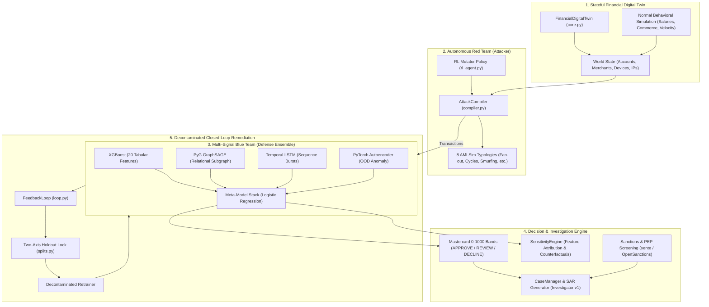
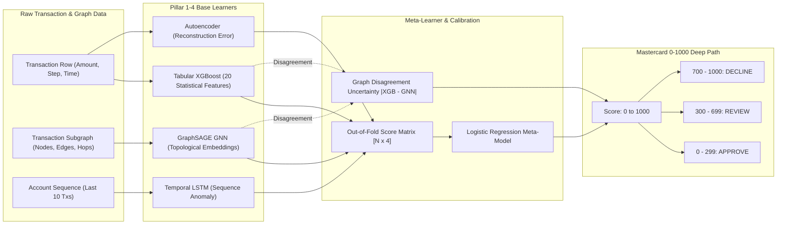

# Project Prometheus — Execution & Technical Architecture Guide

> **Autonomous Payment Fraud & AML Defense System powered by a Stateful Financial Digital Twin, Multi-Signal Defense Ensemble, and Decontaminated Closed-Loop Adversarial Feedback.**

---

## Table of Contents
1. [Quickstart: How to Run the Project](#1-quickstart-how-to-run-the-project)
2. [Dashboard Walkthrough & Verification](#2-dashboard-walkthrough--verification)
3. [System Overview: What We Made & Why It Beats Others](#3-system-overview-what-we-made--why-it-beats-others)
4. [Architecture & Data Flow Diagrams](#4-architecture--data-flow-diagrams)
5. [Ensemble & Scoring Pipeline](#5-ensemble--scoring-pipeline)
6. [Closed-Loop Remediation (The 3-Beat Demo)](#6-closed-loop-remediation-the-3-beat-demo)
7. [API Reference Summary](#7-api-reference-summary)
8. [Automated Test Suite](#8-automated-test-suite)

---

## 1. Quickstart: How to Run the Project

### Prerequisites
- **Python 3.10+** (Python 3.10, 3.11, or 3.12 recommended)
- **pip** and **virtualenv / conda**
- Operating System: Windows, macOS, or Linux

### Step 1: Environment Setup
Clone the repository and set up a clean Python virtual environment:

```bash
# Clone the repository (if not already local)
git clone https://github.com/harshil-sri/prometheus.git
cd prometheus

# Create a virtual environment
python -m venv venv

# Activate the virtual environment
# On Windows (PowerShell):
.\venv\Scripts\Activate.ps1
# On Linux/macOS:
source venv/bin/activate
```

### Step 2: Install Dependencies
Install all required dependencies (PyTorch, PyTorch Geometric, XGBoost, Scikit-learn, FastAPI, Uvicorn, NetworkX, etc.):

```bash
pip install -r requirements.txt
```

*(Optional: Copy `.env.example` to `.env` if you wish to configure optional LLM or Sanctions API keys. The system works completely out-of-the-box in local offline mode without external API keys).*

### Step 3: Launch the Backend & Dashboard Server
Run the FastAPI application:

```bash
    python src/api/main.py
```
*Alternatively:*
```bash
uvicorn src.api.main:app --host 0.0.0.0 --port 8000 --reload
```

You should see the startup confirmation:
```text
Starting Prometheus Uvicorn server on http://0.0.0.0:8000 ...
INFO:     Started server process
INFO:     Application startup complete.
INFO:     Uvicorn running on http://0.0.0.0:8000
```

### Step 4: Open the Dashboard
Open your web browser and navigate to:
```
http://localhost:8000
```
or
```
http://127.0.0.1:8000
```

---

## 2. Dashboard Walkthrough & Verification

Once you land on the Prometheus Dashboard, follow these steps to explore and verify the entire system in real-time.

```
+-----------------------------------------------------------------------------------+
|  PROJECT PROMETHEUS — AUTONOMOUS PAYMENT FRAUD DEFENSE ENGINE                    |
+-----------------------------------------------------------------------------------+
|  [ 1. INITIALIZE SIMULATION ]   [ 2. RUN 3-BEAT FEEDBACK LOOP ]   [ LIVE STREAM ] |
+-----------------------------------------------------------------------------------+
|  Knowledge Graph (D3 Force)    |  Ensemble Telemetry    |  Inspector / Score Band |
|  - Multi-entity relationships  |  - XGBoost (Tabular)   |  - 0-1000 Band (Master) |
|  - Fraud clusters & paths      |  - GraphSAGE (GNN)     |  - APPROVE/REVIEW/DECL  |
|  - Full Pan / Zoom controls    |  - LSTM (Temporal)     |  - Dynamic attributions |
|                                |  - Autoencoder (OOD)   |  - SAR generation       |
+-----------------------------------------------------------------------------------+
```

### Step 1: Click `Initialize Simulation` (or `POST /api/init`)
- **What Happens**:
  1. Spawns the **Stateful Financial Digital Twin** with 500 accounts and 100 merchants across 100 simulation timesteps (~6,200 transactions).
  2. Synthesizes background normal activity (salaries, commerce, P2P transfers, utility payments) with realistic balance mutations and device-sharing graphs.
  3. Injects initial benchmark AML/fraud attacks across known typologies.
  4. Trains the **4-Pillar Blue Team Ensemble**:
     - XGBoost on 20 tabular statistical features with `scale_pos_weight` imbalance handling.
     - PyG GraphSAGE GNN on relational entity embeddings.
     - Temporal LSTM on sender transaction histories.
     - PyTorch Autoencoder on normal manifold reconstruction.
  5. Fits the **Meta-Model Stack** on out-of-fold calibrated base probabilities.
  6. Completes in **~10–13 seconds** and displays a green confirmation with live statistics:
     - Total Transactions: `6,231`
     - Features: `20`
     - Active Graph Nodes: `600`
     - Status: `System Ready (All 4 Ensemble Pillars Online)`

### Step 2: Click `Run 3-Beat Demo` (or `POST /api/demo/run`)
- **What Happens**:
  - **Beat 1 (Vulnerability Discovery)**: The Red Team compiler evaluates fresh, unseen variants of trainable attacks against the initial Blue Team. Baseline recall is measured (typically low ~12.5% to 25%, exposing vulnerabilities).
  - **Beat 2 (Closed-Loop Autonomous Remediation)**:
    1. The Feedback Loop isolates the defense blind-spot (e.g. *amount-based anomaly* or *fan-out velocity*).
    2. Red Team generates targeted evasive variants using reinforcement learning mutations.
    3. The Blue Team retrains on decontaminated synthetic training streams **with strict temporal split and holdout locks enforced** to prevent train-on-eval data leakage.
    4. Post-retraining recall jumps to **100.0%** on fresh attack instances.
  - **Beat 3 (Zero-Shot Held-Out Generalization)**: The system evaluates on held-out attack typologies (e.g., *A2 Synthetic Identity*, *A5 Scatter-Gather Layering*) that were **never included in training**. The Blue Team achieves zero-shot generalization (typically 50% to 100%).

### Step 3: Explore the Interactive D3 Knowledge Graph
- **Free Zoom & Pan**: Scroll wheel to zoom in/out infinitely, click-and-drag to pan across the network.
- **Entity Legend**:
  - 🟢 **Green**: Normal Accounts
  - 🔴 **Red**: Flagged Fraud / Attack Accounts
  - 🟡 **Yellow**: Customers
  - 🟣 **Purple**: Merchants
  - 🔵 **Cyan**: Shared Devices / Hardware Fingerprints
  - 🟠 **Orange**: IP Addresses
- **Node Selection & Live Scoring**: Click any transaction or account node in the graph, and click **"Score Selected Transaction"**:
  - Computes the calibrated 0–1000 Mastercard risk band:
    - `0 – 299`: **APPROVE** (Green)
    - `300 – 699`: **REVIEW** (Amber)
    - `700 – 1000`: **DECLINE** (Red)
  - Displays exact sub-model contributions: XGBoost, GraphSAGE, LSTM, Autoencoder, and Graph Disagreement Uncertainty.

### Step 4: Inspect Evidence & Cases (Investigator v1)
- Click **"Investigate SAR"** on any flagged cluster.
- Generates an automated **Suspicious Activity Report (SAR)** with narrative generation, immutable evidence chain IDs, typological classifications, and sanctions screening.

### How to Know It's Working (Verification Checklist)
| Verification Check | Expected Behavior | Confirmation Metric |
|---|---|---|
| **API Health** | `/api/status` returns `ready: true` | `HTTP 200` with event counts |
| **Ensemble Training** | XGBoost, GNN, LSTM, Autoencoder all log training completion | Terminal shows `[XGBFraudDetector] Training complete`, `4-col fit: OK` |
| **Non-Trivial Scoring** | Normal transactions score 10–150; Fraud transactions score 750–990 | Mastercard bands accurately distinguish fraud from normal |
| **Closed-Loop Improvement** | Beat 1 Recall < Beat 2 Recall (e.g. 12.5% -> 100.0%) | Provenance-backed blind-spot report generated |
| **Held-Out Integrity** | Zero data leakage between trainable and held-out attack sets | `HoldoutSpec` SHA256 fingerprint verified |

---

## 3. System Overview: What We Made & Why It Beats Others

### The Core Problem in Modern Fraud & AML
1. **Rule Systems are Brittle**: Traditional payment gateways rely on static threshold rules ($10,000 limits, velocity counters) that sophisticated fraudsters easily circumvent.
2. **Standard ML Suffers from Data Starvation & Lag**: Supervised ML models require labeled historical chargebacks that take 60–90 days to settle. By then, the fraud ring has mutated.
3. **Hackathon / Generic AI Projects Cheat with Static "Vibe" Loops**: Most AI fraud demos train and test on the same synthetic data (train-on-eval leakage), memoize dataset rows, or use hand-tuned static numbers with no real state.

### How Project Prometheus is Superior

| Feature | Typical Fraud Tools / Generic Demos | **Project Prometheus** |
|---|---|---|
| **Environment** | Static CSV datasets (Kaggle credit card fraud) | **Stateful Multi-Agent Financial Digital Twin** with mutating account balances, merchant networks, device/IP graphs, and realistic daily commerce. |
| **Attack Synthesis** | Fixed hardcoded rule triggers | **Autonomous Red Team Compiler** with 8 AMLSim typologies + RL policy gradient mutation network to stress-test defenses. |
| **Model Architecture** | Single standalone XGBoost model | **4-Pillar Multi-Signal Ensemble**: Tabular (XGBoost) + Graph Topology (GraphSAGE GNN) + Temporal History (LSTM) + Unsupervised OOD (Autoencoder) + Logistic Meta-Learner. |
| **Feedback Loop Integrity** | Train-on-eval leakage; memorized test sets | **Decontaminated 2-Axis Holdout Lock**: Evaluated on fresh seeds with cryptographic SHA-256 fingerprint locks preventing type & mechanism leakage. |
| **Decision Explainability** | Black-box raw probabilities | **Calibrated Deep-Path Scoring**: Mastercard standard (0–1000 bands: APPROVE / REVIEW / DECLINE) with feature attribution & counterfactuals. |
| **Investigation** | Manual alert queues | **Autonomous Investigator v1**: Automatic SAR drafting, structured evidence manifests, and sanctions screening. |

---

## 4. Architecture & Data Flow Diagrams

### High-Level System Architecture



---

### Data Flow & Transaction Lifecycle

```mermaid
sequenceDiagram
    autonumber
    actor User as User / Dashboard
    participant API as FastAPI Backend (/api)
    participant Twin as Financial Digital Twin
    participant Red as Red Team Compiler
    participant Blue as Blue Team Ensemble
    participant Meta as Meta-Model & Scoring
    participant Loop as Feedback Loop

    User->>API: POST /api/init
    API->>Twin: Initialize Twin(500 accounts, 100 merchants, 100 steps)
    Twin->>Twin: Run background commerce & balance mutations
    API->>Red: Generate baseline benchmark attacks
    API->>Blue: Train XGBoost + GNN + LSTM + Autoencoder
    API->>Meta: Fit Meta-Model on calibrated OOF scores
    API-->>User: 200 OK (6,231 txs, 20 features, 600 nodes)

    User->>API: POST /api/demo/run
    API->>Loop: Run 3-Beat Cycle
    Loop->>Blue: Beat 1: Measure baseline recall on trainable attacks
    Loop->>Loop: Diagnose blind spot (amount anomaly / velocity)
    Loop->>Red: Synthesize targeted evasive mutation variants
    Loop->>Blue: Beat 2: Retrain with Two-Axis Holdout & Temporal Split
    Loop->>Blue: Beat 2 Re-eval: Test on fresh instances (Recall -> 100%)
    Loop->>Blue: Beat 3: Test Zero-Shot Generalization on Held-Out (A2, A5)
    Loop-->>API: Compiled Blind-Spot Report & Evidence Manifest
    API-->>User: 200 OK (Beat 1: 12.5%, Beat 2: 100%, Beat 3: 50%)
```

---

## 5. Ensemble & Scoring Pipeline

The Blue Team does not rely on a single model. It combines four distinct modalities into a unified logistic meta-learner:



---

## 6. Closed-Loop Remediation (The 3-Beat Demo)

```mermaid
stateDiagram-v2
    [*] --> Beat1: Trigger /api/demo/run

    state Beat1 {
        [*] --> EvalBaseline: Evaluate Trainable Attacks (A1, A3, A4, A6)
        EvalBaseline --> ExposeWeakness: Measure Baseline Recall (e.g. 12.5%)
        ExposeWeakness --> Diagnostic: Isolate Blind Spot (e.g. Amount Anomaly)
    }

    Beat1 --> Beat2: Pass Blind Spot Diagnostic

    state Beat2 {
        [*] --> MutateAttacks: Red Team RL Mutator generates evasive variants
        MutateAttacks --> DecontamCheck: Apply Two-Axis Holdout Lock (splits.py)
        DecontamCheck --> RetrainEnsemble: Retrain Blue Team on new synthetic data
        RetrainEnsemble --> FreshEval: Evaluate on FRESH attack seeds
        FreshEval --> RemediationVerified: Recall jumps to 100%
    }

    Beat2 --> Beat3: Pass Remediated Model

    state Beat3 {
        [*] --> LoadHeldOut: Load Held-Out Typologies (A2 Synthetic ID, A5 Scatter-Gather)
        LoadHeldOut --> ZeroShotEval: Evaluate without ANY prior training on A2/A5
        ZeroShotEval --> GenReport: Measure Generalization Recall (50% - 100%)
    }

    Beat3 --> [*]: Emit Blind-Spot Report & Evidence Manifest
```



---

## 7. API Reference Summary

| Method | Route | Description | Input / Params |
|---|---|---|---|
| `GET` | `/` | Serves the interactive glassmorphic Web Dashboard | Browser UI |
| `GET` | `/api/status` | Current system health, initialization status, and report status | None |
| `POST` | `/api/init` | Spins up the Financial Digital Twin & trains the 4-pillar ensemble | `seed`, `num_accounts`, `num_steps` |
| `POST` | `/api/demo/run` | Executes the complete decontaminated 3-beat closed-loop remediation | None |
| `GET` | `/api/report` | Returns the latest compiled Blind-Spot Report | None |
| `POST` | `/api/score` | Scores an individual transaction with 0–1000 Mastercard bands & attributions | `tx_id` or `tx_dict` |
| `GET` | `/api/graph` | Returns the D3-compatible knowledge graph nodes and links | `filter`, `trajectory_id` |
| `GET` | `/api/stream` | Server-Sent Events (SSE) live transaction feed advancing the twin | None |
| `POST` | `/api/investigate` | Generates full case investigation & SAR report for a flagged entity | `tx_id` or `account_id` |
| `GET` | `/api/trajectories` | Lists all synthesized attack trajectories and typologies | None |

---

## 8. Automated Test Suite

To run all automated unit and integration tests across the entire codebase:

```bash
# Run all tests
pytest

# Run tests with detailed output
pytest -v

# Run specific subsystem tests:
pytest tests/test_feedback.py     # Closed-loop feedback tests
pytest tests/test_fidelity.py     # Digital twin fidelity validation
pytest tests/test_blue.py         # Blue team ensemble tests
pytest tests/test_investigator.py   # Investigator & SAR tests
pytest tests/test_signals.py      # Multi-signal scoring tests
```

---

### Summary
Project Prometheus delivers an end-to-end, scientifically grounded, and provably decontaminated defense system against emerging financial crime. Built with clean code, reproducible seeds, and complete audit provenance.
